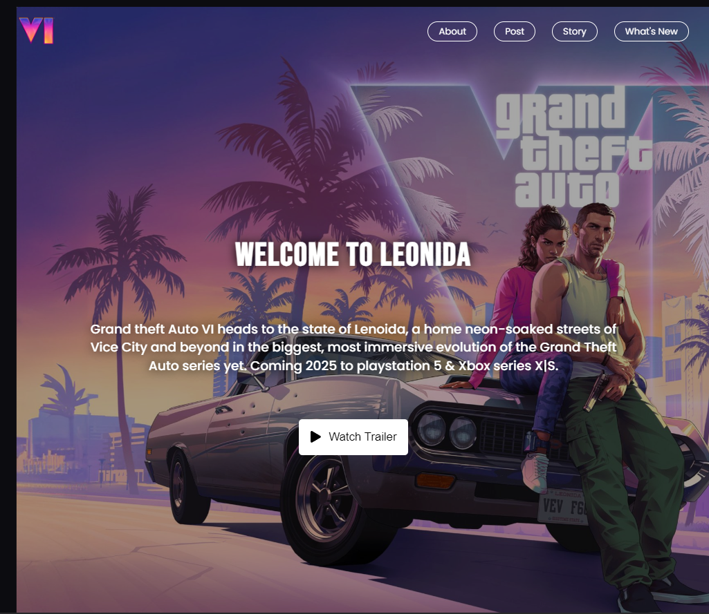
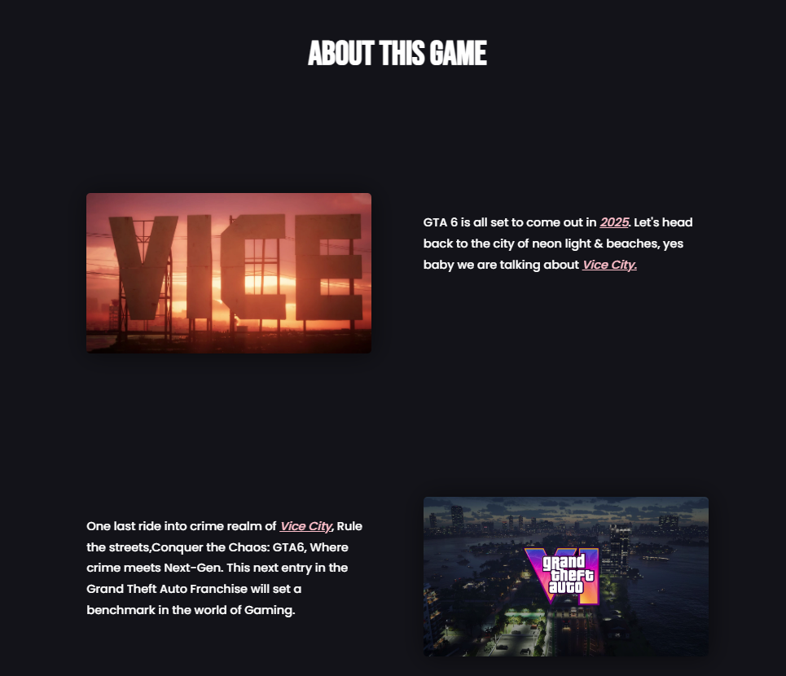
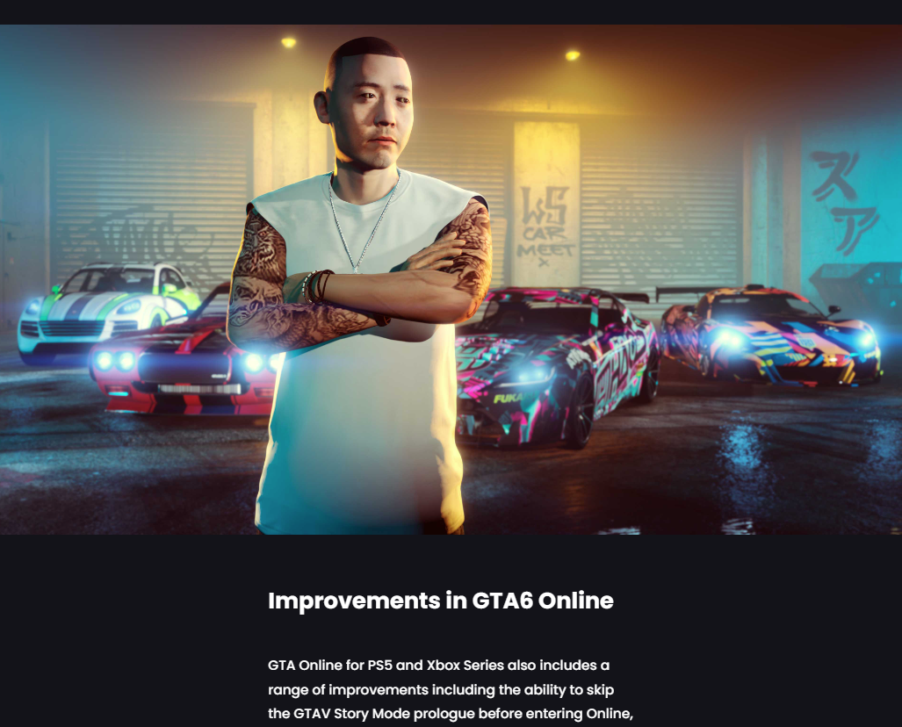
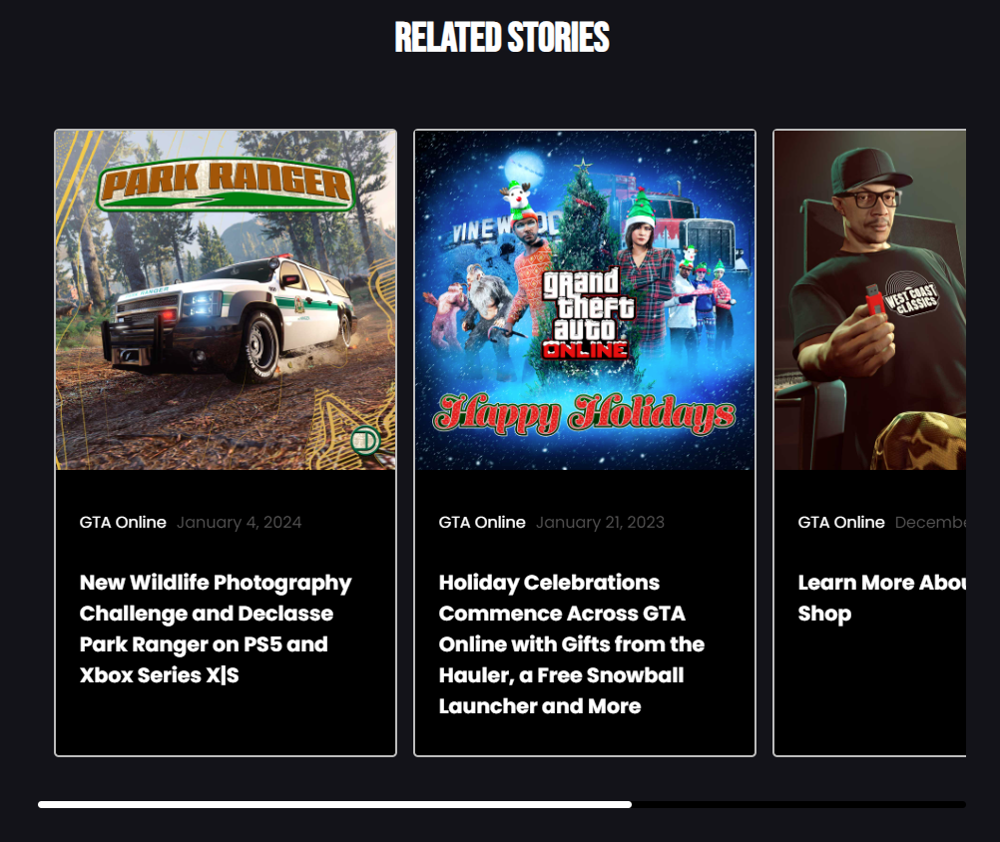
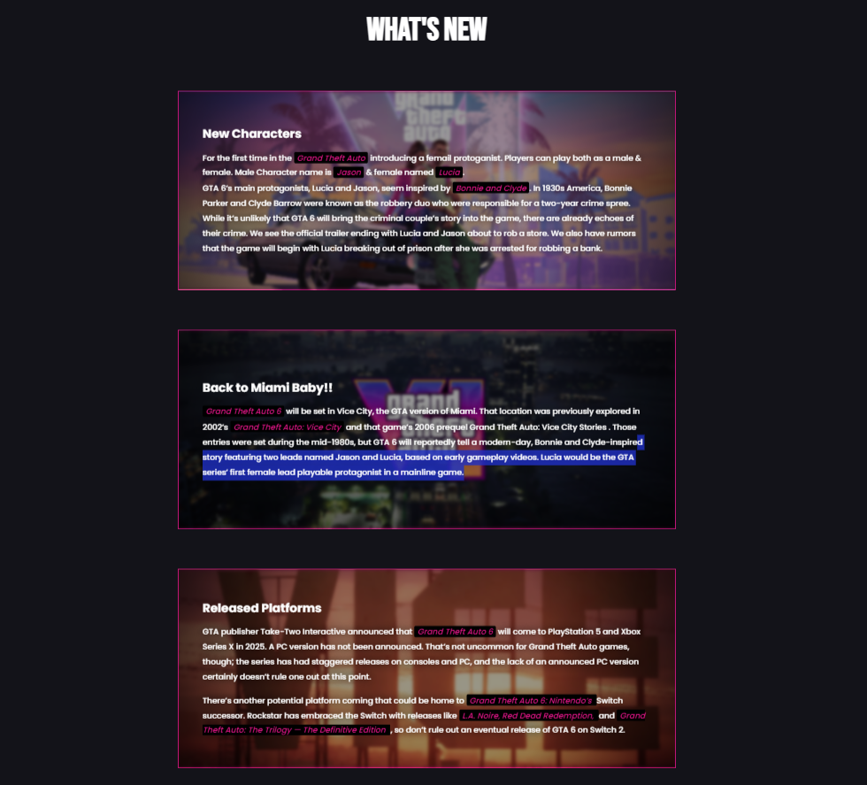

# GTA 6 Website Concept Clone

## Libraries & Tech Stack Used

- Framework :- ReactJS
- IDE :- Neovim
- React Icons :- Icons
- GSAP :- Scroll Reveal Animations
- Typescript :- For Type Checking

## How to run locally

1. First clone for fork the repository, then in root folder install all the necessary packages using the command `npm install`.

2. Run the server using `npm run dev`.

### View the Live Site Here <ins>_[Live Site](https://gta6-website.vercel.app/)_</ins>

## GTA6 Website

### Landing Page

### About Section

### Online Mode Section

### Stories Section

### What's New Section

